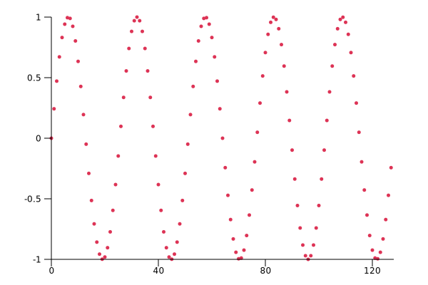

# Fourier transform
Toy implementations of discrete naive and fast fourier transform algorithms. 

Todo-list:
- [x] Naive Fourier transform algorithm
- [x] Fast Fourier transform algorithm ([Radix-2 Cooley–Tukey FFT algorithm](https://en.wikipedia.org/wiki/Cooley%E2%80%93Tukey_FFT_algorithm))
- [x] Plots using [plotlib](https://docs.rs/plotlib/latest/plotlib/)
- [ ] Replace plotlib with a library allowing to draw continuous graphs from discrete set of points

Plots:

128-points discretization of the wave sin(5x)

Real part of the fourier transform of the above discretization

Imaginary part of the fourier transform of the above discretization
